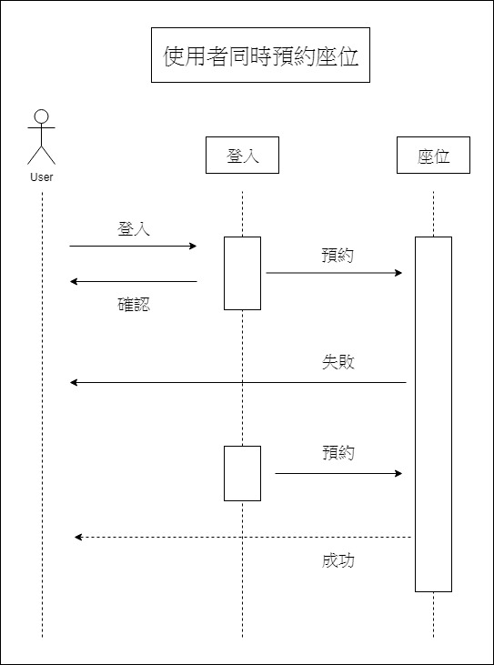
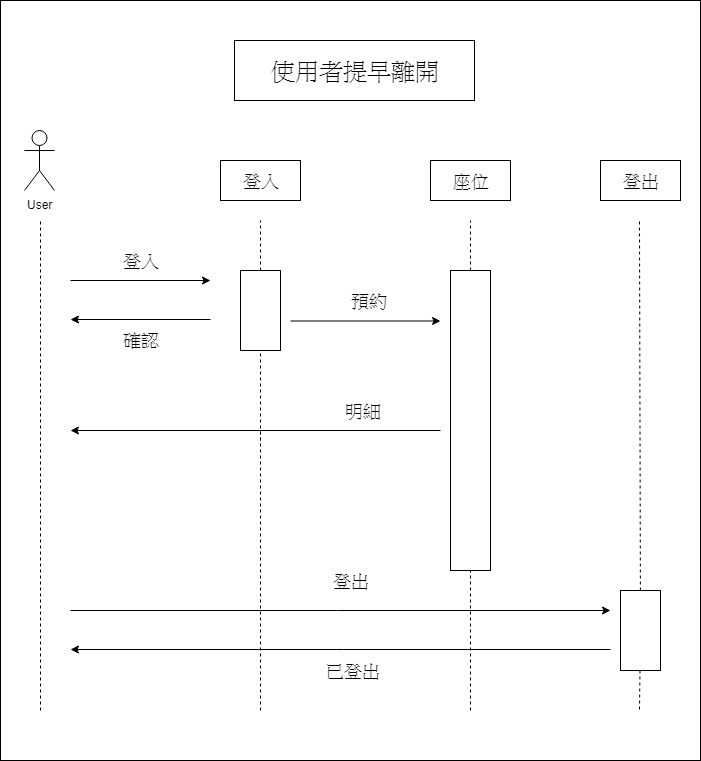

###### 1.題目：第Ｅ書房－電腦預約系統

###### 2.需求：快速查詢電腦使用狀況，並登記預約

###### 3.功能性需求：
######   (1)查詢空缺座位
######   (2)確認預約座位
######   (3)修改預約者資料

###### 非功能性需求：
###### * 操作性：系統能夠隨身攜帶
###### * 效能：每1分鐘系統將自動更新電腦使用狀況
###### * 安全：只有管理者可查詢登記系統

###### 4.使用案例圖

###### 5.由上而下 使用案例：
    1.使用者同時預約座位
    2.使用者取消預約座位
    3.使用者提早離開

###### 6.三個使用案例：
    一.使用者同時預約座位
        1.決定今天是否去圖書館
        2.打開App查看
        3.看到有空位事先預約
            3.1 多個使用者同時預約同個座位            3.1.1系統當機
            3.2 每個使用方都預約失敗                  3.1.2管理者收到通知
            3.3 隨機挑選一位預約成功                  3.1.3管理者通知技術人員
        4.出發去圖書館
        5.找到位置感應證件確認已到達

    二.使用者取消預約座位
        1.決定今天是否去圖書館
        2.打開App查看
        3.看到有空位事先預約
        4.出發去圖書館
            4.1 在出發的路途上發生意外
            4.2 取消所預約的位置                   4.2.1使用者未能取消所預約的位置
                                                  4.2.2座位閒置10分鐘，系統告知管理者
                                                  4.2.3管理者詢問預約者是否還須使用此座位

    三.使用者提早離開
        1.決定今天是否去圖書館
        2.打開App查看
        3.看到有空位事先預約
        4.出發去圖書館
        5.找到位置感應證件確認已到達
            5.1 需要提早離開座位
            5.2 將座位取消讓給後面使用者             5.2.1電腦無法執行登出作業
                                                   5.2.2使用者向管理員告知，並請管理員結束使用此座位

###### 7.user story：

    身為一個學生，我希望能事先查詢第Ｅ書房中電腦的使用狀況，因而決定是否前往。
    身為一個管理員，我希望能有效管理電腦座位，這樣有人來詢問時能確切告知對方是否有空位能使用且能使用多久。
    
###### 8.初步類別圖：
   1.使用者同時預約同個座位
   
   2.使用者取消預約
   
   3.使用者提早離開
   
   4.全部類別圖
   
###### 9.系統循序圖：
   
    
   
    
   

###### 10.強韌圖：
   
    
   
    
   

###### 11.循序圖：
   
    
   
    
   
