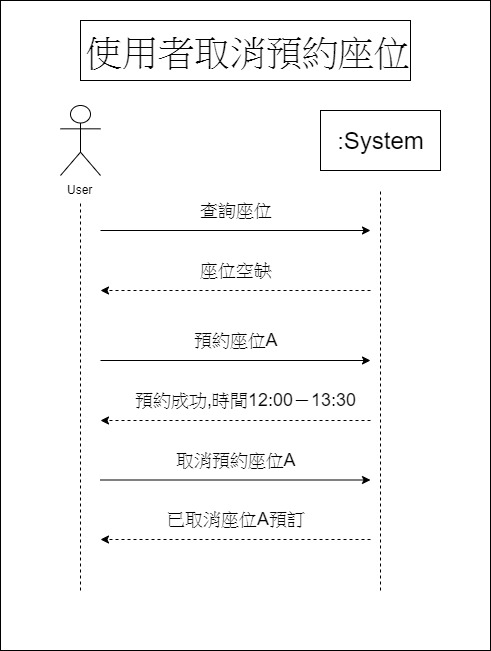
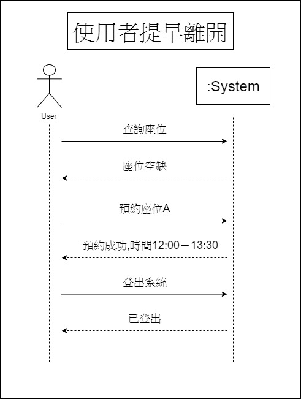

###### 1.題目：第Ｅ書房－電腦預約系統

###### 2.需求：快速查詢電腦使用狀況，並登記預約

###### 3.功能性需求：
###### 只需輸入學號及姓名，就能隨時隨地查詢第E書房中電腦的使用狀況並提前預約使用及使用時間
###### 非功能性需求：
###### * 操作性：系統能夠隨身攜帶
###### * 效能：每1分鐘系統將自動更新電腦使用狀況
###### * 安全：只有管理者可查詢登記系統

###### 4.使用案例圖

###### 5.由上而下 使用案例：
    1.決定今天是否去圖書館
    2.打開App查看
    3.看到有空位事先預約
    4.出發去圖書館
    5.找到位置感應證件確認已到達

###### 6.三個使用案例：
    一.
        1.決定今天是否去圖書館
        2.打開App查看
        3.看到有空位事先預約
            3.1 兩個使用者同時預約同個座位
            3.2 兩邊都預約失敗
            3.3 隨機請一方預約別位
        4.出發去圖書館
        5.找到位置感應證件確認已到達

    二.
        1.決定今天是否去圖書館
        2.打開App查看
        3.看到有空位事先預約
        4.出發去圖書館
            4.1  再出發的路途上發生意外
            4.2 取消所預約的位置

    三.
        1.決定今天是否去圖書館
        2.打開App查看
        3.看到有空位事先預約
        4.出發去圖書館
        5.找到位置感應證件確認已到達
            5.1 需要提早離開座位
            5.2 將座位取消讓給後面使用者

###### 7.user story：
    身為一個學生，我希望能事先查詢第Ｅ書房中電腦的使用狀況，因而決定是否前往
    
###### 8.初步類別圖：
   
    
   
    
   

###### 9.系統循序圖：
   
    
   
    
   
